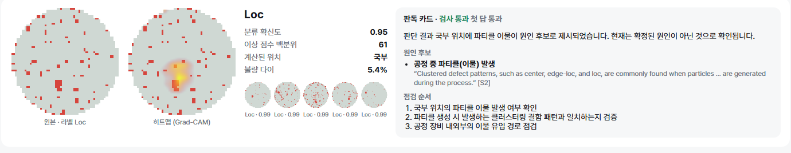
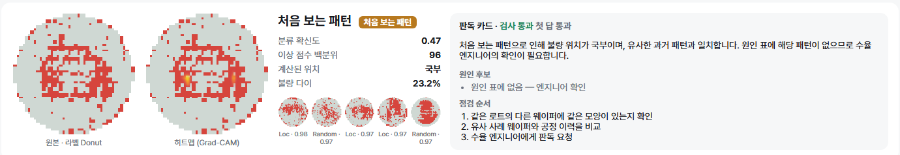
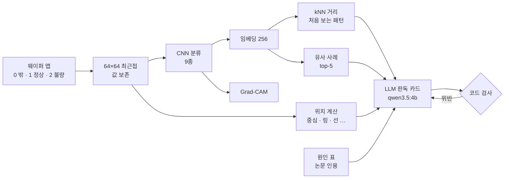
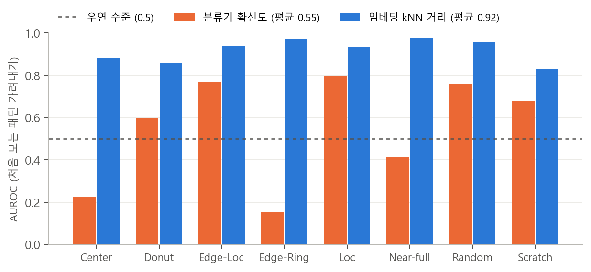
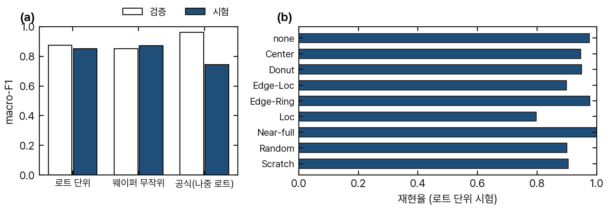
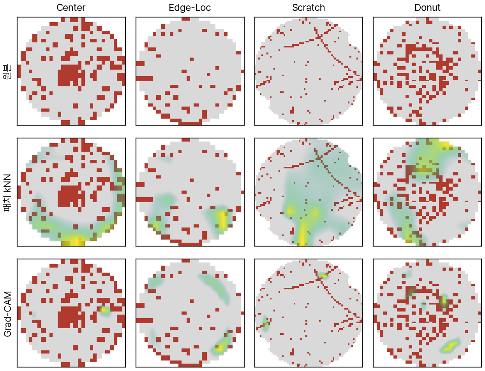
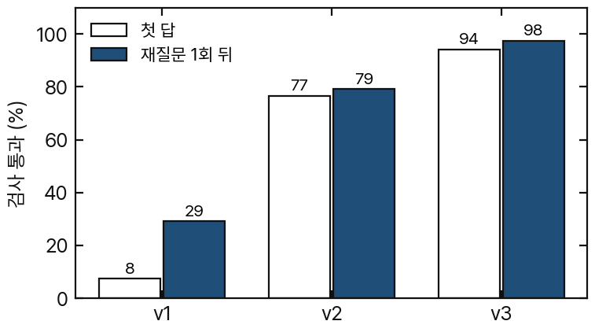
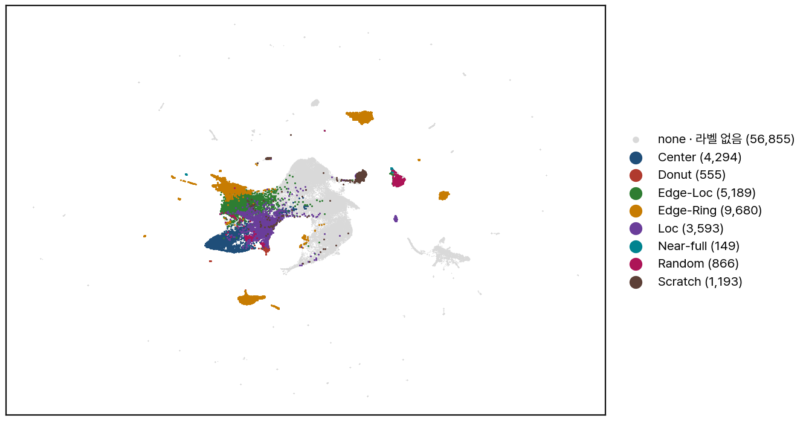

# 🔬 wafer-defect-agent

웨이퍼 맵 불량 패턴 판독 에이전트 (PyTorch · 로컬 LLM) + 검증
아는 패턴 분류 · 처음 보는 패턴 경고 · 위치 · 유사 사례 · 원인 후보 판독 카드


## 요약

- 🗺️ 데이터: WM-811K 실제 팹 웨이퍼 맵 811,457장 (라벨 172,950 · 9종)
- 🧠 분류: CNN macro-F1 0.853 (로트 단위 분할)
- 🚨 처음 보는 패턴: 임베딩 kNN AUROC 0.919 · 분류기 확신도 0.549
- 🔥 히트맵: Grad-CAM 결함 적중 64 % (무작위 36 % · 패치 kNN 26 %)
- 🔍 유사 사례 검색: 정밀도@5 0.856
- 🤖 판독 카드: 로컬 qwen3.5:4b · 코드 검사 통과 첫 답 94 % (v1 8 %) · 1.7 초/장
- 🐞 틀린 가설 5개 · 기록으로 남김

## 판독 예시



<sub>그림 1. 원본 · Grad-CAM · 판정(확신도 · 이상 점수 백분위 · 계산된 위치) · 유사 과거 웨이퍼 5장 · 판독 카드. 아래는 Donut 을 뺀 모델에 Donut 이 들어온 경우 — 경고, 원인 비움</sub>

- 판정 · 위치 · 유사 사례: 코드 계산
- 원인 후보: 논문 원문 인용 표(`src/wafer/causes.json`) 안에서만
- LLM: 옮겨 쓰기만 → 코드 검사 → 걸리면 재질문
- 전체 화면: [`reports/screen/index.html`](reports/screen/index.html) · 한 장 판독: `scripts/read_wafer.py`

## 처리 흐름



## 처음 보는 패턴


<sub>그림 2. 불량 8종을 하나씩 학습에서 빼고, 뺀 패턴을 가려내는 성능. (a) AUROC, 점선 = 우연 (b) 오경보 5 %에서 재현율</sub>

- 분류기 확신도: 평균 AUROC 0.549 — 우연 수준
- 모르는 패턴을 자신 있게 우겨 넣음: Edge-Ring 91 % → Edge-Loc, Center 89 % → Loc
- 임베딩 kNN 거리: 평균 AUROC 0.919 · 재현율 57 % → 경고 기준으로 채택
- 약한 곳: Center · Donut · Scratch 재현율 22~27 % → 경고는 '사람 확인 요청'

## 분할 · 시간 이동


<sub>그림 3. (a) 분할 방식별 macro-F1 (b) 로트 단위 시험 재현율</sub>

- 공식 분할: 로트 겹침 0 → 누수 가설 틀림
- 대신 분할 사이 똑같은 맵 3,158장 · 라벨 충돌 14묶음 → 제거
- 웨이퍼 무작위 분할 부풀림: +0.018 (작음)
- 나중 로트: 같은 시기 검증 0.963 → 시험 0.743
- 약한 패턴: Loc 재현율 0.797

## 히트맵



<sub>그림 4. 원본 · 패치 kNN(PatchCore 식) · Grad-CAM. 로트 test 불량 668장 pointing game — 패치 kNN 26 % · 무작위 36 % · Grad-CAM 64 %</sub>

- 패치 kNN: 결함 대신 웨이퍼 가장자리 모양에 반응 → 무작위보다 못함
- Grad-CAM(16×16) 으로 교체
- 한계: Center 덩어리를 비껴가는 경우 있음

## 판독 에이전트



<sub>그림 5. 같은 120장 · 같은 검사기로 다시 채점한 판독 카드 검사 통과율</sub>

| 판 | 문제 | 고친 것 |
|---|---|---|
| v1 | 조건부 규칙("처음 보는 패턴이면 …")을 조건과 상관없이 따라 함 · 95장 | 경고가 켜졌을 때만 규칙 넣기 |
| v2 | 근거 표 없는 곳에서 "양자역학적 불안정성" 지어냄 | 점검 순서 고정 선택지 · 표 밖 공정 어휘 검사 |
| v3 | 첫 답 94 % · 재질문 뒤 98 % | 끝까지 걸린 3장 → 사람 확인 |

| 검사 | 걸리는 경우 |
|---|---|
| 판정 | 분류 결과와 다른 패턴 |
| 위치 | 코드 계산값과 다른 위치 |
| 원인 id | 원인 표 밖 |
| 문장 | 다른 패턴의 원인 · 표 밖 공정 어휘 |
| 경고 | 켜졌는데 원인 고름 · 꺼졌는데 '처음 보는 패턴' |
| 점검 순서 | 처음 보는 패턴인데 고정 선택지 밖 |

## 81만 장 지도


<sub>그림 6. 임베딩 UMAP — 라벨 불량 전부 · none 1.5만 · 라벨 없음 4만 · 가장 낯선 2천 (82,374점)</sub>

- 패턴별 섬으로 모임 · 대화형 판은 `reports/screen/index.html`
- 라벨 없는 웨이퍼 중 가장 낯선 200장: 새 패턴 아님 → 깨진 모양의 맵 (면적 30 % 미만 200장 · 불량률 50 % 초과 199장)
- → 새 패턴 경고 앞에 맵 품질 검사 필요

## 검증

| 대상 | 기준 | 결과 |
|---|---|---|
| 분할 누수 | 로트 단위 분할 · 똑같은 맵 제거 | train · test 로트 겹침 0 |
| 처음 보는 패턴 | 한 종류씩 빼고 학습 (8번) | AUROC 0.919 · 재현율 57 % |
| 히트맵 위치 | 계통 불량 덩어리 pointing game | 64 % (무작위 36 %) |
| 유사 사례 | 로트가 다른 학습 웨이퍼에서 검색 | 정밀도@5 0.856 |
| 위치 계산 | 합성 웨이퍼 8종 · 실제 라벨 | Center → 중심 82 % · Edge-Ring → 링 73 % |
| 판독 카드 | 코드 검사 · 120장 | 첫 답 94 % |
| 지표 코드 | scikit-learn 과 대조 | macro-F1 · 재현율 · AUROC 일치 |

## 틀렸던 가설

| 처음 생각 | 실제 |
|---|---|
| 공식 분할이 같은 로트를 섞어 성능이 부풀려진다 | 공식 분할은 로트 겹침 0 · 대신 똑같은 맵 3,158장 |
| 웨이퍼 무작위 분할은 크게 부풀린다 (같은 로트 쌍 같은 패턴 0.927) | +0.018 F1 |
| 패치 kNN 으로 결함 위치를 칠할 수 있다 | 무작위보다 못함 (26 % 대 36 %) |
| 판독 규칙은 조건문으로 한 번에 적으면 된다 | 4B 모델이 조건과 무관하게 따라 함 |
| 가장 낯선 라벨 없는 웨이퍼 = 새 불량 패턴 | 깨진 모양의 맵 |

상세: [`reports/`](reports/) — 단계별 보고서 · 원자료 JSON · 틀렸던 측정도 지우지 않음

<details>
<summary><b>📊 수치</b></summary>

| 항목 | 결과 |
|---|---|
| 라벨 · 중복 제거 | 172,950 → 169,684장 (중복 3,238 · 충돌 28) |
| 분류 macro-F1 | 로트 0.853 · 웨이퍼 무작위 0.871 · 공식 시험 0.743 (검증 0.963) |
| 로트 시험 재현율 | none 0.976 · Center 0.946 · Donut 0.949 · Edge-Loc 0.898 · Edge-Ring 0.977 · Loc 0.797 · Near-full 1.000 · Random 0.900 · Scratch 0.905 |
| 처음 보는 패턴 AUROC | 임베딩 kNN 0.919 · 패치 kNN 0.795 · MSP 0.549 · 에너지 0.474 |
| 오경보 5 % 재현율 | 임베딩 kNN 0.570 · MSP 0.286 |
| 유사 사례 정밀도@5 | 임베딩 0.856 · 원본 픽셀 16×16 0.459 |
| 히트맵 pointing game | Grad-CAM 16×16 0.636 · 8×8 0.533 · 무작위 0.359 · 패치 kNN 0.257 |
| 판독 검사 (v3) | 첫 답 94.2 % · 재질문 뒤 97.5 % · 처음 보는 패턴 24장 100 % |
| 속도 | 학습 에폭 44 초 · 판독 1.7 초/장 (RTX 3060 Ti) |

</details>

<details>
<summary><b>⚙️ 실행</b></summary>

```bash
python -m venv --system-site-packages .venv           # torch(CUDA) 는 시스템 것
.venv/Scripts/python -m pip install umap-learn plotly
# data/raw/MIR-WM811K/Python/WM811K.pkl ← http://mirlab.org/dataset/public/MIR-WM811K.zip
python scripts/eda.py && python scripts/prep.py && python scripts/prep_all.py
bash scripts/run_queue.sh "--split lot" "--split wafer" "--split official"
bash scripts/run_queue.sh "--split lot --exclude Center --epochs 12"   # … 8종
python scripts/ood_eval.py && python scripts/heatmap_eval.py
python scripts/map_search.py && python scripts/umap_map.py
ollama pull qwen3.5:4b && python scripts/agent_eval.py
python scripts/summarize.py && python scripts/make_screen.py && python scripts/make_readme_figures.py
python scripts/read_wafer.py --novel 1                 # 한 장 판독 (--row N · --npy 파일)
python -m pytest
```

</details>

<details>
<summary><b>🗂️ 구성</b></summary>

| 경로 | 역할 |
|---|---|
| `src/wafer/prep.py` | 최근접 리사이즈 · 중복 제거 · 로트 / 웨이퍼 분할 |
| `src/wafer/model.py` · `train.py` | CNN · 학습 · 평가 |
| `src/wafer/ood.py` | MSP · 에너지 · 임베딩 kNN · 패치 kNN |
| `src/wafer/heat.py` | Grad-CAM · 패치 kNN 히트맵 |
| `src/wafer/locate.py` | 계통 불량 덩어리 · 위치 이름 |
| `src/wafer/reader.py` | 판정 + 경고 + 유사 사례 + 위치 → 판독 사례 |
| `src/wafer/agent.py` · `causes.json` | LLM 판독 카드 · 코드 검사 · 원인 표 |
| `scripts/` | 진단 · 학습 · 평가 · 화면 · 그림 |
| `tests/` | pytest · hypothesis 32개 |
| `reports/` | 단계별 보고서 · 원자료 JSON · 판독 화면 |

</details>

## 한계

- 시드 1회 · 처음 보는 패턴 실험 모델은 12 에폭 (주 모델 20)
- 원인 표: 논문 두 편의 일반론 · 실제 팹 공정 이력과 연결 없음 → 카드는 '후보'만
- 검사기: 어휘 목록 밖의 지어낸 말 · 수치 주장은 못 잡음
- 위치 계산: 규칙 · Donut → 도넛 일치 38 %
- 공식 분할 하락: 시간 이동과 학습 자료 차이의 몫 미분리

## 라이선스

- 코드: [MIT](LICENSE)
- 데이터: WM-811K — 저장소에 없음, 그림 · 화면의 웨이퍼 맵은 이 데이터에서 만듦 → [`DATA_NOTICE.md`](DATA_NOTICE.md) (저작권 표시 · 이용 조건 · 인용 2개)
  - [1] M.-J. Wu, J.-S. R. Jang, J.-L. Chen, "Wafer Map Failure Pattern Recognition and Similarity Ranking for Large-Scale Data Sets," *IEEE Transactions on Semiconductor Manufacturing*, 28(1), 1–12, 2015. doi:10.1109/TSM.2014.2364237
  - [2] MIR-WM811K: Dataset for wafer map failure pattern recognition, 2015. http://mirlab.org/dataset/public/
- 원인 표 인용 (CC BY 논문 · 짧은 원문 인용 + 출처 표시)
  - Chen et al., *Frontiers in Neuroscience* 17:1202985, 2023 (원 인용 Cheon et al., *IEEE TSM* 32:163–170, 2019)
  - Shin & Yoo, *Sensors* 23(4):1926, 2023
