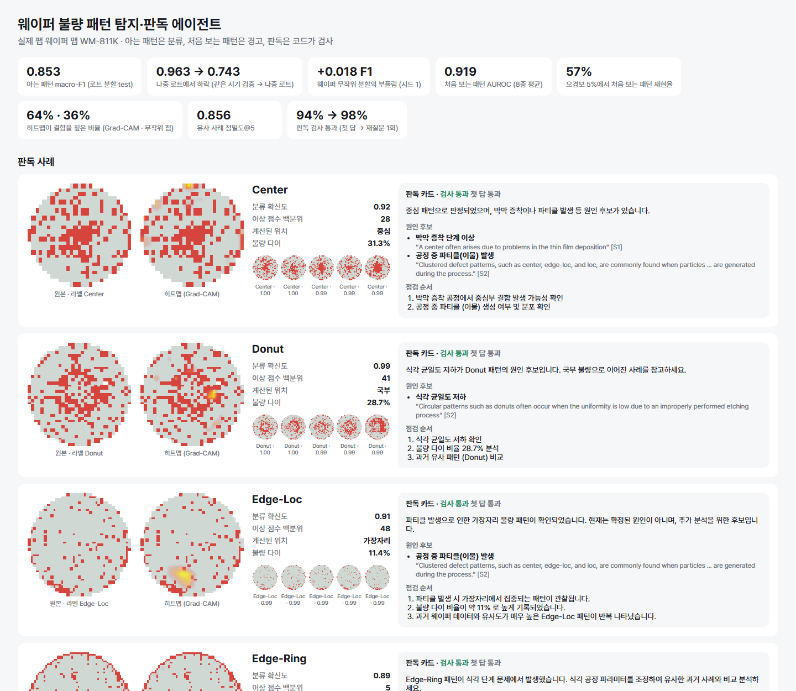
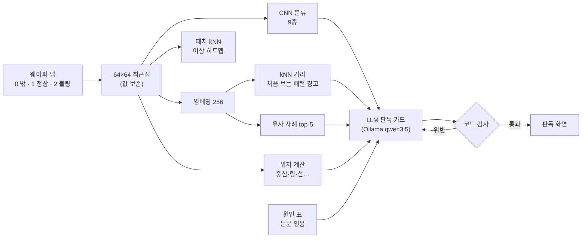

# wafer-defect-agent — 웨이퍼 불량 패턴 탐지·판독 에이전트

실제 팹 웨이퍼 맵 81만 장(WM-811K)으로
**아는 불량 패턴은 분류하고, 처음 보는 패턴은 따로 경고하고, 둘 다 위치·유사 사례·원인 후보를 붙인 판독 카드**를 만든다.
판독 카드는 로컬 LLM 이 쓰고, **코드가 검사**한다 — 문헌 표 밖의 원인, 계산과 다른 위치, 판정과 모순이면 되묻는다.



## 요약

<!-- SUMMARY -->

## 왜 이렇게 만들었나

- **분류기는 모르는 패턴도 자신 있게 우겨 넣는다.** 한 종류씩 학습에서 빼 보니 분류기 확신도(MSP)로 '처음 보는 것'을 가려내는 AUROC 는 평균 0.549 — 우연 수준이었다. Edge-Ring 을 뺀 모델은 Edge-Ring 의 91 %를 Edge-Loc 이라고 답했다. 그래서 경고는 확신도가 아니라 **임베딩 공간의 거리(kNN)** 로 건다.
- **같은 시기 검증 점수를 믿지 않는다.** 공식 분할에서 학습과 같은 시기 로트로 검증하면 macro-F1 0.963, 나중 로트에서는 0.743 이었다.
- **LLM 은 사실을 만들지 않고 옮기기만 한다.** 판정·위치·유사 사례는 코드가 계산하고, 원인은 논문 원문 인용이 달린 표(`src/wafer/causes.json`) 안에서만 고른다.

## 구성



| 단계 | 스크립트 | 결과 |
|---|---|---|
| 1 진단 | `scripts/eda.py` · `eda_lot.py` | `reports/2026-09-25_step1_diagnosis.md` |
| 2 분류·분할 비교 | `scripts/prep.py` · `train_cls.py` · `run_queue.sh` | `reports/2026-09-25_step2_classifier.md` |
| 3 처음 보는 패턴 | `scripts/ood_eval.py` | `reports/2026-09-25_step3_unseen.md` |
| 4 지도·검색 | `scripts/prep_all.py` · `map_search.py` | `reports/map_search.json` |
| 5 판독 에이전트 | `scripts/agent_eval.py` | `reports/agent_eval.json` |
| 6 화면 | `scripts/make_screen.py` | `reports/screen/index.html` |

## 검증

<!-- VERIFY -->

## 실행

```bash
python -m venv --system-site-packages .venv      # torch(CUDA) 는 시스템 것을 쓴다
.venv/Scripts/python -m pip install umap-learn plotly
# data/raw/MIR-WM811K/Python/WM811K.pkl 을 받아 둔다 (아래 데이터)
python scripts/eda.py && python scripts/prep.py && python scripts/prep_all.py
bash scripts/run_queue.sh "--split lot" "--split wafer" "--split official"
bash scripts/run_queue.sh "--split lot --exclude Center --epochs 12"   # … 8종
python scripts/ood_eval.py && python scripts/map_search.py
ollama pull qwen3.5:4b && python scripts/agent_eval.py
python scripts/summarize.py && python scripts/make_screen.py
python -m pytest
```

환경: Python 3.14 · torch 2.13 (CUDA 12.6) · RTX 3060 Ti 8 GB · Ollama

## 한계

- 시드 1회. 처음 보는 패턴 실험의 제외 모델은 12 에폭(주 모델 20).
- 위치 계산은 규칙이다. 라벨과의 일치는 Center→중심 82 % · Edge-Ring→링 73 % · Scratch→선 65 % · Donut→도넛 38 % 수준.
- 원인 표는 논문 두 편의 일반론이다. 실제 팹의 공정 이력과 연결하지 않았다 — 판독 카드는 '후보'만 말한다.
- 공식 분할의 성능 하락에서 시간 이동과 학습 자료 차이의 몫을 나누지 못했다.

## 데이터 · 인용

WM-811K (MIR Lab). Copyright 2015 Jyh-Shing Roger Jang. 이용 조건에 따라 아래 두 인용을 함께 적는다. 데이터는 이 저장소에 넣지 않는다.

- [1] M.-J. Wu, J.-S. R. Jang, J.-L. Chen, "Wafer Map Failure Pattern Recognition and Similarity Ranking for Large-Scale Data Sets," *IEEE Transactions on Semiconductor Manufacturing*, 28(1), 1–12, 2015. doi:10.1109/TSM.2014.2364237
- [2] MIR-WM811K: Dataset for wafer map failure pattern recognition, 2015. http://mirlab.org/dataset/public/

원인 후보 출처 (`src/wafer/causes.json`):

- Chen et al., "Wafer defect recognition method based on multi-scale feature fusion," *Frontiers in Neuroscience* 17:1202985, 2023 — 원 인용 Cheon et al., *IEEE TSM* 32:163–170, 2019
- Shin & Yoo, "Efficient Convolutional Neural Networks for Semiconductor Wafer Bin Map Classification," *Sensors* 23(4):1926, 2023
