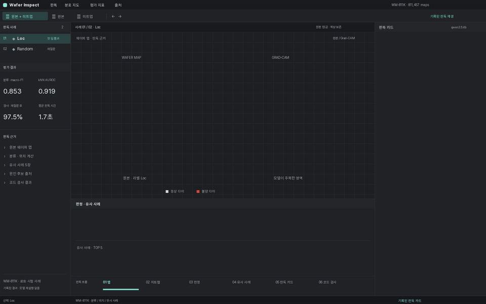
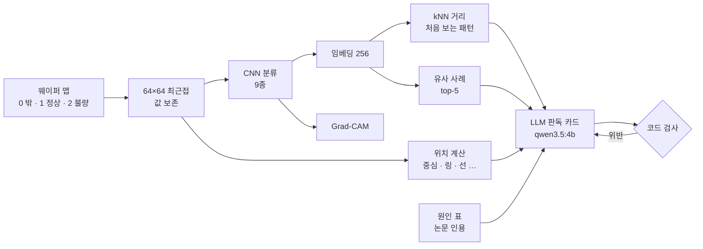
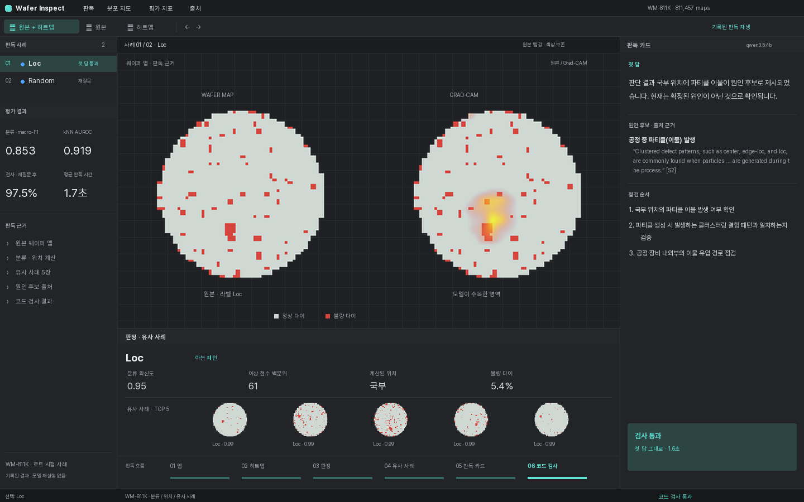
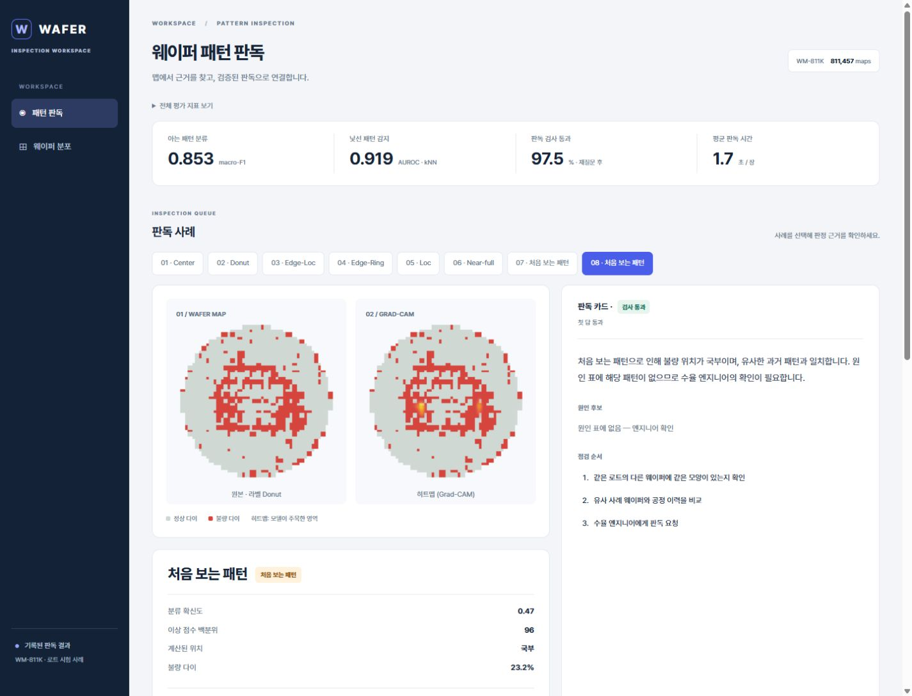
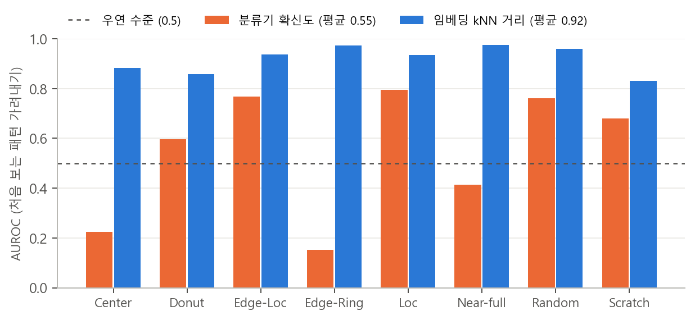
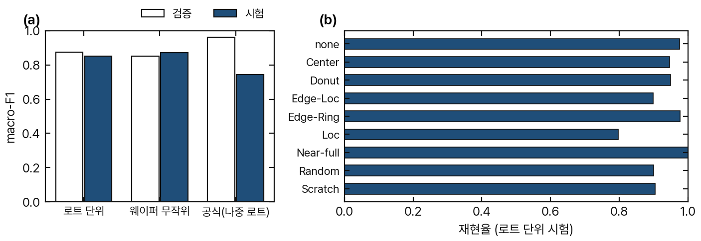
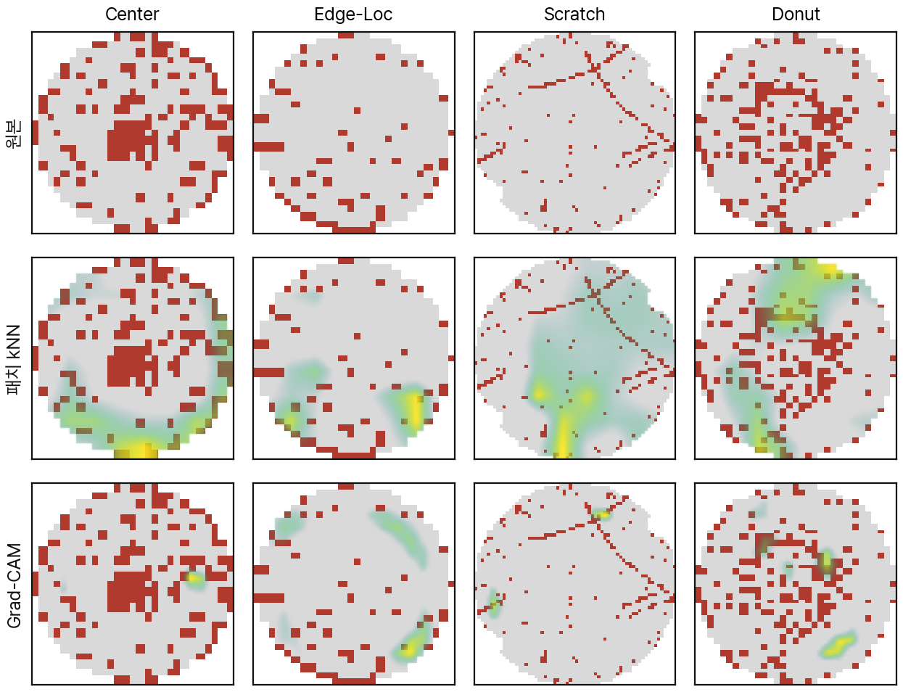
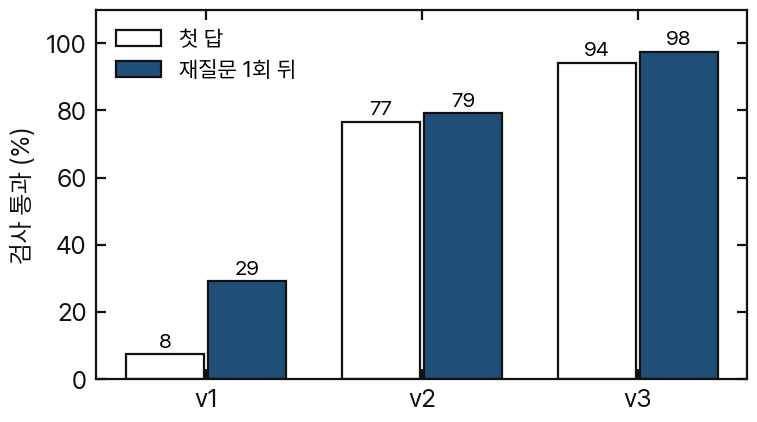
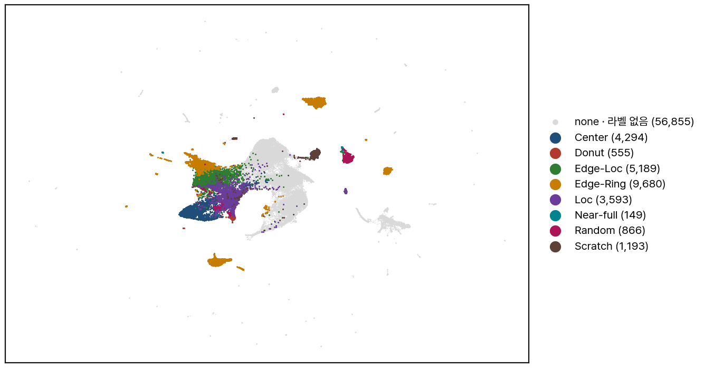
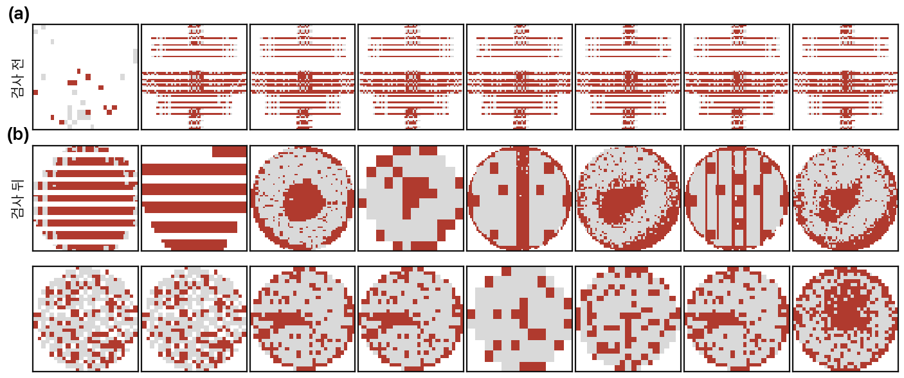

# Wafer Map Defect Pattern Inspection with Out-of-Distribution Warning and Verified LLM Reports

웨이퍼 맵 불량 패턴 판독 에이전트 — 분류 · 처음 보는 패턴 경고 · 위치 · 유사 사례 · 원인 후보 판독 카드

Haejyn · 기술 보고서 · 2026



<sub>그림 0. 판독 흐름 재생. 사례 1은 첫 답 통과, 사례 2는 첫 답이 코드 검사에 걸려 재질문 후 통과. 기록된 출력 그대로이며 모델을 다시 실행하지 않음 ([MP4](docs/media/agent.mp4), `scripts/make_agent_animation.py`)</sub>

[새 판독 화면 열기](https://haejyn.github.io/demos/wafer/) — 사례를 선택해 원본 맵·Grad-CAM·판정 지표·검증된 판독 카드를 확인할 수 있습니다. 기록된 결과를 탐색하는 데모입니다.

## Abstract

WM-811K 실제 팹 웨이퍼 맵 811,457장(라벨 172,950장, 9종)을 대상으로 불량 패턴 판독 체계를 구성하였다. 판정 · 위치 · 유사 사례는 코드가 계산하고, 원인 후보는 논문 원문을 인용한 표 안에서만 고르며, 로컬 LLM(qwen3.5:4b)은 이를 판독 카드로 옮겨 쓰는 역할만 맡는다. LLM 출력은 코드 검사를 거치고, 위반 시 재질문한다. 로트 단위 분할에서 CNN 분류 macro-F1 0.853, 학습에서 제외한 패턴의 검출 AUROC 0.943(마할라노비스)을 얻었으며, 분류기 확신도(MSP)는 0.549로 우연 수준임을 확인하였다. 판독 카드는 첫 답 기준 94 %가 코드 검사를 통과한다. 틀렸던 가설과 실패한 실험 6건도 함께 기록한다.

## Contributions

1. **처음 보는 패턴 경고.** 불량 8종을 하나씩 학습에서 제외하는 실험에서 임베딩 거리 기반 점수(마할라노비스 0.943, 임베딩 kNN 0.919)가 분류기 확신도(0.549)보다 크게 우수함을 보였다.
2. **누수 없는 평가.** 로트 단위 분할과 분할 간 동일 맵 3,158장 · 라벨 충돌 14묶음 제거로 평가하고, 시간 이동(같은 시기 검증 0.963 → 나중 로트 시험 0.743)을 측정하였다.
3. **위치 근거.** Grad-CAM 결함 적중률 64 %(무작위 36 %, 패치 kNN 26 %), 유사 사례 검색 정밀도@5 0.856.
4. **검증된 판독 카드.** 원인 후보를 인용 표로 제한하고 6종 코드 검사를 적용하여 첫 답 통과율을 8 %(v1)에서 94 %(v3)로 개선하였다. 처리 속도 1.7 초/장.
5. **맵 품질 검사.** 면적 기준으로 깨진 맵 2,654장을 거른 뒤, 9종에 없는 줄무늬 · 혼합 패턴 후보가 드러남을 보였다.

## Method


```mermaid
flowchart LR
    M["웨이퍼 맵<br/>0 밖 · 1 정상 · 2 불량"] --> P["64×64 최근접<br/>값 보존"]
    P --> C["CNN 분류<br/>9종"]
    C --> E["임베딩 256"]
    E --> K["kNN 거리<br/>처음 보는 패턴"]
    E --> S["유사 사례<br/>top-5"]
    C --> H["Grad-CAM"]
    P --> L["위치 계산<br/>중심 · 링 · 선 …"]
    K & S & L --> A["LLM 판독 카드<br/>qwen3.5:4b"]
    T["원인 표<br/>논문 인용"] --> A
    A --> V{"코드 검사"}
    V -- 위반 --> A
```

- 판정 · 위치 · 유사 사례: 코드 계산
- 원인 후보: 논문 원문 인용 표(`src/wafer/causes.json`) 안에서만 선택
- LLM: 옮겨 쓰기만 수행 → 코드 검사 → 위반 시 재질문
- 전체 화면: [`reports/screen/index.html`](reports/screen/index.html) · 한 장 판독: `scripts/read_wafer.py`
- 화면 디자인: `docs/ui/inspection.css` · 사례 선택: `docs/ui/inspection.js` · 화면 생성기와 영상 렌더러가 같은 정보 구조를 사용합니다.



<sub>그림 1. 원본 · Grad-CAM · 판정(확신도 · 이상 점수 백분위 · 계산된 위치) · 유사 과거 웨이퍼 5장 · 판독 카드. 아래는 Donut 을 제외하고 학습한 모델에 Donut 이 입력된 경우로, 경고가 켜지고 원인은 비워진다.</sub>

## Experiments

### 1. 처음 보는 패턴 검출


<sub>그림 2. 불량 8종을 하나씩 학습에서 제외하고, 제외한 패턴을 가려내는 AUROC. (a) 음성 = 아는 패턴 전부(none 포함) (b) 음성 = 아는 불량만. 점선 = 우연</sub>

| 점수 | AUROC (a) | 재현율 @ 오경보 5 % (a) | AUROC (b) | 재현율 @ 오경보 5 % (b) |
|---|---|---|---|---|
| 분류기 확신도 (MSP) | 0.549 | 29 % | 0.616 | 19 % |
| 에너지 | 0.474 | 24 % | 0.571 | 19 % |
| 임베딩 kNN | 0.919 | 58 % | **0.868** | **44 %** |
| 마할라노비스 | **0.943** | **74 %** | 0.836 | 43 % |

- 분류기 확신도는 우연 수준이다. 모르는 패턴을 높은 확신으로 아는 패턴에 배정한다(Edge-Ring 91 % → Edge-Loc, Center 89 % → Loc).
- 임베딩 거리(kNN · 마할라노비스)는 불량끼리만 비교해도 0.84~0.87을 유지한다.
- 약점은 Scratch(마할라노비스, 불량끼리 0.56)이며, 따라서 경고는 '사람 확인 요청'으로 사용한다.

### 2. 분할 방식과 시간 이동


<sub>그림 3. (a) 분할 방식별 macro-F1 (b) 로트 단위 시험 재현율</sub>

- 공식 분할의 로트 겹침은 0으로, 누수 가설은 기각되었다.
- 대신 분할 간 동일 맵 3,158장과 라벨 충돌 14묶음을 확인하여 제거하였다.
- 웨이퍼 무작위 분할에 의한 부풀림은 +0.018로 작다.
- 나중 로트: 같은 시기 검증 0.963 → 시험 0.743.
- 약한 패턴: Loc 재현율 0.797.

### 3. 결함 위치 히트맵



<sub>그림 4. 원본 · 패치 kNN(PatchCore 방식) · Grad-CAM. 로트 test 불량 668장 pointing game — 패치 kNN 26 % · 무작위 36 % · Grad-CAM 64 %</sub>

- 패치 kNN은 결함 대신 웨이퍼 가장자리 형상에 반응하여 무작위보다 낮았다.
- 따라서 Grad-CAM(16×16)으로 교체하였다.
- 한계: Center 덩어리를 비껴가는 경우가 있다.

### 4. 판독 에이전트



<sub>그림 5. 동일한 120장 · 동일한 검사기로 재채점한 판독 카드 검사 통과율</sub>

| 버전 | 문제 | 수정 |
|---|---|---|
| v1 | 조건부 규칙("처음 보는 패턴이면 …")을 조건과 무관하게 따름 · 95장 | 경고가 켜졌을 때만 규칙 삽입 |
| v2 | 근거 표가 없는 곳에서 "양자역학적 불안정성"을 지어냄 | 점검 순서 고정 선택지 · 표 밖 공정 어휘 검사 |
| v3 | 첫 답 94 % · 재질문 후 98 % | 끝까지 걸린 3장은 사람 확인 |

| 검사 | 위반 조건 |
|---|---|
| 판정 | 분류 결과와 다른 패턴 |
| 위치 | 코드 계산값과 다른 위치 |
| 원인 id | 원인 표 밖 |
| 문장 | 다른 패턴의 원인 · 표 밖 공정 어휘 |
| 경고 | 켜졌는데 원인 선택 · 꺼졌는데 '처음 보는 패턴' |
| 점검 순서 | 처음 보는 패턴인데 고정 선택지 밖 |

### 5. 전체 81만 장 지도와 맵 품질 검사


<sub>그림 6. 임베딩 UMAP — 라벨 불량 전부 · none 1.5만 · 라벨 없음 4만 · 가장 낯선 2천 (82,374점)</sub>


<sub>그림 7. 라벨 없는 웨이퍼 중 가장 낯선 것. (a) 품질 검사 전 상위 8장 (b) 검사 후 상위 16장</sub>

- 품질 검사 전 '가장 낯선 200장'은 모두 깨진 형상의 맵이었다(면적 30 % 미만).
- 품질 검사: 웨이퍼 면적 < 0.5 → 맵 이상, 2,654장(0.33 %). 정상 맵 면적 중앙값 0.775.
- 검사 후 상위 24장: 줄무늬 8 · 중심 + 링 혼합 6 · 저해상도 맵 3 · 기타 7 (육안 분류, 확인 필요).
- 줄무늬 · 혼합 패턴은 번호가 이어지는 이웃 로트, 같은 다이 크기에서 반복된다. 원인 표에 없으므로 사람 확인으로 넘긴다.

### 6. 나중 로트 따라잡기 (진행 중)

- 공식 시험 로트를 로트 번호순 5묶음으로 흘리며, 묶음마다 1 %(231장)만 라벨을 달아 추가 학습한다.
- v1 결과(묶음 2~5 평균 macro-F1): 업데이트 없음 0.719 · 낯섦 선택 0.711 · 에이전트 선택 0.704 · 무작위 0.667.
- 어떤 선택 방법도 업데이트 없음을 넘지 못했고, 첫 업데이트 직후 공통 하락이 나타났다. 추가 학습 절차가 모델을 흔든 것으로 판단한다.
- 낯섦 · 에이전트 선택은 불량 웨이퍼를 무작위보다 약 6배 많이 골랐다(51 % 대 8 %).
- v2: 라벨 없는 추가 학습 대조군과 부드러운 업데이트로 재측정 중 → [`reports/2026-09-26_stepD-B_ood-v2_catchup-v1.md`](reports/2026-09-26_stepD-B_ood-v2_catchup-v1.md)

## Verification

| 대상 | 기준 | 결과 |
|---|---|---|
| 분할 누수 | 로트 단위 분할 · 동일 맵 제거 | train · test 로트 겹침 0 |
| 처음 보는 패턴 | 한 종류씩 제외 학습 (8회) · 음성 두 가지 | AUROC 0.943 · 불량끼리만 0.868 |
| 히트맵 위치 | 계통 불량 덩어리 pointing game | 64 % (무작위 36 %) |
| 유사 사례 | 로트가 다른 학습 웨이퍼에서 검색 | 정밀도@5 0.856 |
| 위치 계산 | 합성 웨이퍼 8종 · 실제 라벨 | Center → 중심 82 % · Edge-Ring → 링 73 % |
| 판독 카드 | 코드 검사 · 120장 | 첫 답 94 % |
| 지표 코드 | scikit-learn 과 대조 | macro-F1 · 재현율 · AUROC 일치 |

### Rejected Hypotheses

| 초기 가설 | 실제 |
|---|---|
| 공식 분할이 같은 로트를 섞어 성능이 부풀려진다 | 공식 분할은 로트 겹침 0 · 대신 동일 맵 3,158장 |
| 웨이퍼 무작위 분할은 크게 부풀린다 (같은 로트 쌍 같은 패턴 0.927) | +0.018 F1 |
| 패치 kNN 으로 결함 위치를 칠할 수 있다 | 무작위보다 낮음 (26 % 대 36 %) |
| 판독 규칙은 조건문으로 한 번에 적으면 된다 | 4B 모델이 조건과 무관하게 따름 |
| 가장 낯선 라벨 없는 웨이퍼 = 새 불량 패턴 | 깨진 형상의 맵 → 품질 검사 후에야 줄무늬 · 혼합 패턴 |
| 라벨 1 %씩 추가 학습하면 나중 로트를 따라잡는다 | v1: 모든 선택 방법이 업데이트 없음보다 낮음 (0.667~0.711 대 0.719) |

단계별 보고서 · 원자료 JSON 은 [`reports/`](reports/)에 있으며, 틀렸던 측정도 삭제하지 않는다.

### Detailed Results

| 항목 | 결과 |
|---|---|
| 라벨 · 중복 제거 | 172,950 → 169,684장 (중복 3,238 · 충돌 28) |
| 분류 macro-F1 | 로트 0.853 · 웨이퍼 무작위 0.871 · 공식 시험 0.743 (검증 0.963) |
| 로트 시험 재현율 | none 0.976 · Center 0.946 · Donut 0.949 · Edge-Loc 0.898 · Edge-Ring 0.977 · Loc 0.797 · Near-full 1.000 · Random 0.900 · Scratch 0.905 |
| 처음 보는 패턴 AUROC | 마할라노비스 0.943 · 임베딩 kNN 0.919 · 패치 kNN 0.795 · MSP 0.549 · 에너지 0.474 (불량끼리만: kNN 0.868 · 마할라노비스 0.836 · MSP 0.616) |
| 오경보 5 % 재현율 | 마할라노비스 0.744 · 임베딩 kNN 0.579 · MSP 0.286 |
| 맵 품질 검사 | 면적 < 0.5 · 2,654장 (0.33 %) · 이전 가장 낯선 200장 모두 검출 |
| 유사 사례 정밀도@5 | 임베딩 0.856 · 원본 픽셀 16×16 0.459 |
| 히트맵 pointing game | Grad-CAM 16×16 0.636 · 8×8 0.533 · 무작위 0.359 · 패치 kNN 0.257 |
| 판독 검사 (v3) | 첫 답 94.2 % · 재질문 후 97.5 % · 처음 보는 패턴 24장 100 % |
| 속도 | 학습 에폭 44 초 · 판독 1.7 초/장 (RTX 3060 Ti) |

## Limitations

- 시드 1회 실험이다(시드 3회 · 로트 단위 부트스트랩 신뢰구간 진행 중). 처음 보는 패턴 실험 모델은 12 에폭(주 모델 20)이다.
- 원인 표는 논문 두 편의 일반론으로, 실제 팹 공정 이력과 연결되어 있지 않다. 카드는 '후보'만 제시한다.
- 검사기는 어휘 목록 밖의 지어낸 표현과 수치 주장을 잡지 못한다.
- 위치 계산은 규칙 기반이며, Donut → 도넛 일치율은 38 %다.
- 공식 분할의 성능 하락에서 시간 이동과 학습 자료 차이의 몫을 분리하지 않았다.

## Getting Started

### Requirements

- Python 3.14, PyTorch 2.13 (CUDA), Ollama (`qwen3.5:4b`)
- 측정 환경: NVIDIA RTX 3060 Ti

```bash
python -m venv --system-site-packages .venv           # torch(CUDA) 는 시스템 것을 사용
.venv/Scripts/python -m pip install umap-learn plotly
```

### Data Preparation

WM-811K 는 저장소에 포함하지 않는다. [MIR-WM811K.zip](http://mirlab.org/dataset/public/MIR-WM811K.zip) 을 받아 `data/raw/MIR-WM811K/Python/WM811K.pkl` 에 둔다.

```bash
python scripts/eda.py && python scripts/prep.py && python scripts/prep_all.py
```

### Training and Evaluation

```bash
bash scripts/run_queue.sh "--split lot" "--split wafer" "--split official"
bash scripts/run_queue.sh "--split lot --exclude Center --epochs 12"   # … 8종
python scripts/ood_eval.py && python scripts/ood_eval_v2.py --seed 0 && python scripts/heatmap_eval.py
python scripts/map_search.py && python scripts/umap_map.py
ollama pull qwen3.5:4b && python scripts/agent_eval.py
python scripts/catchup.py --budget 0.01 --seed 0      # 나중 로트 따라잡기
python scripts/summarize.py && python scripts/make_screen.py && python scripts/make_readme_figures.py
python scripts/read_wafer.py --novel 1                 # 한 장 판독 (--row N · --npy 파일)
python -m pytest                                       # pytest · hypothesis 34개
```

### Repository Structure

| 경로 | 역할 |
|---|---|
| `src/wafer/prep.py` | 최근접 리사이즈 · 중복 제거 · 로트 / 웨이퍼 분할 |
| `src/wafer/model.py` · `train.py` | CNN · 학습 · 평가 |
| `src/wafer/ood.py` | MSP · 에너지 · 임베딩 kNN · 마할라노비스 · 패치 kNN |
| `src/wafer/heat.py` | Grad-CAM · 패치 kNN 히트맵 |
| `src/wafer/locate.py` | 계통 불량 덩어리 · 위치 이름 |
| `src/wafer/reader.py` | 판정 + 경고 + 유사 사례 + 위치 → 판독 사례 |
| `src/wafer/agent.py` · `causes.json` | LLM 판독 카드 · 코드 검사 · 원인 표 |
| `scripts/` | 진단 · 학습 · 평가 · 따라잡기(`catchup.py`) · 화면 · 그림 · GPU 대기(`wait_gpu.sh`) |
| `tests/` | pytest · hypothesis 34개 |
| `reports/` | 단계별 보고서 · 원자료 JSON · 판독 화면 |

## Citation

```bibtex
@misc{haejyn2026waferdefectagent,
  author       = {Haejyn},
  title        = {Wafer Map Defect Pattern Inspection with Out-of-Distribution Warning and Verified LLM Reports},
  year         = {2026},
  howpublished = {\url{https://github.com/Haejyn/wafer-defect-agent}}
}
```

## License

- 코드: [MIT](LICENSE)
- 데이터: WM-811K 는 저장소에 포함하지 않는다. 그림과 화면의 웨이퍼 맵은 이 데이터로 생성하였다. 저작권 표시 · 이용 조건은 [`DATA_NOTICE.md`](DATA_NOTICE.md) 참조.

## References

1. M.-J. Wu, J.-S. R. Jang, J.-L. Chen, "Wafer Map Failure Pattern Recognition and Similarity Ranking for Large-Scale Data Sets," *IEEE Transactions on Semiconductor Manufacturing*, 28(1), 1–12, 2015. doi:10.1109/TSM.2014.2364237
2. MIR-WM811K: Dataset for wafer map failure pattern recognition, 2015. http://mirlab.org/dataset/public/
3. Chen et al., *Frontiers in Neuroscience* 17:1202985, 2023 (원 인용 Cheon et al., *IEEE TSM* 32:163–170, 2019) — 원인 표 인용, CC BY, 짧은 원문 인용과 출처 표시
4. Shin & Yoo, *Sensors* 23(4):1926, 2023 — 원인 표 인용, CC BY, 짧은 원문 인용과 출처 표시
