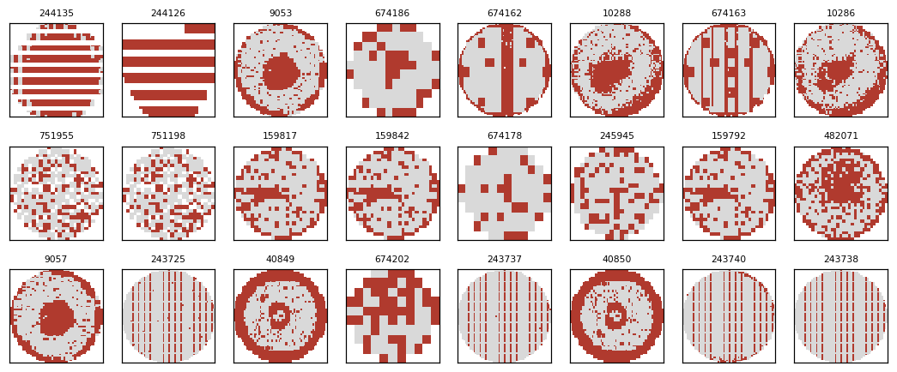

# F. 맵 품질 검사 — 2026-09-26

원자료: `reports/map_quality_gate.json` · 통계 `runs/map_quality_stats.npz`

## 규칙

웨이퍼 면적(64×64 칸 중 웨이퍼 칸 비율) **< 0.5 → 맵 이상**, 새 패턴 경고 앞에서 거른다.
근거: 81만 장 면적 분포 — 하위 0.1 % 0.278 · 1 % 0.746 · 5 % 0.761 · 중앙값 0.775 (원 넓이 π/4 ≈ 0.785). 정상 맵은 0.74 위에 몰려 있다.

## 결과

| 항목 | 값 |
|---|---|
| 걸린 맵 | 2,654장 (0.33 %) |
| 그중 라벨 있는 맵 | 26장 — 모두 `none` 라벨 |
| 이전 '가장 낯선 200장' 중 걸린 것 | **200 / 200** |

## 검사를 거친 뒤 가장 낯선 24장 (눈으로 본 분류 · 1인 · 확인 필요)

| 모양 | 장수 | 예 (원본 행) |
|---|---|---|
| 세로·가로 줄무늬 — 행/열 단위 반복 불량 | 8 | 243725 · 243737 · 243738 · 243740 · 674162 · 674163 · 244126 · 244135 |
| 혼합 — 중심 덩어리 + 가장자리 링 | 6 | 9053 · 9057 · 10286 · 10288 · 40849 · 40850 |
| 다이가 매우 큰 저해상도 맵 | 3 | 674178 · 674186 · 674202 |
| 그 밖 (산발 · 국부) | 7 | 159792 · 159817 · 159842 · 245945 · 482071 · 751198 · 751955 |

**읽기:** 품질 검사 전의 '새 패턴 후보'는 전부 깨진 맵이었지만, 거른 뒤에는 **기존 9종에 없는 줄무늬·혼합 패턴**이 위로 올라왔다. 새 패턴 경고가 실제로 쓸모 있으려면 품질 검사가 앞에 있어야 한다.
줄무늬·혼합의 공정 원인은 원인 표에 없어 말하지 않는다. 같은 번호대는 같은 로트가 아니라 **번호가 이어지는 이웃 로트 · 같은 다이 크기**였다 — 세로 줄무늬 lot15226~15229(다이 크기 4,899), lot41975(3,047~3,067); 저해상도 맵 lot41976~41977 은 다이 크기 82~91 로 실제로 다이가 아주 적은 제품. 가까운 시기 · 같은 제품에서 반복됐다는 뜻으로 읽는다.
